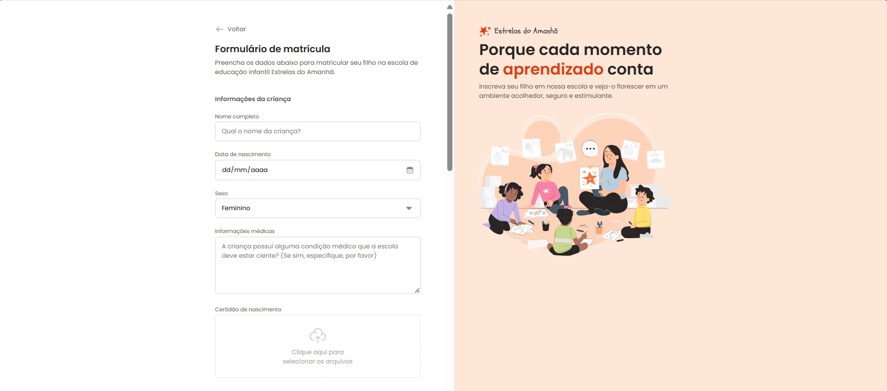

# Estrela do Amanhã



[](LICENSE)

## Descrição
Projeto desenvolvido durante as aulas da Rocketseat, focado em criar uma aplicação web moderna e responsiva.

## Tecnologias Utilizadas
- HTML5
- CSS3
- JavaScript
-

## Instalação
1. Clone o repositório:
```bash
git clone https://github.com/amaurell/estrela-do-amanha.git